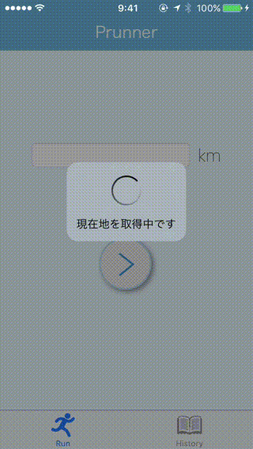

# Prunner - Planing for Runner

## App Store: 申請中


Prunnerとは、その日の気分で無理なく走りたいランナーに向けたiOS用ランニングサポートアプリケーションです。

ランニングコースの作成・編集に特化しておりコースの提案・記録を行うことができます。

# Elevetor Pitch

既存のランニング補助アプリケーションとは違い、走ったコースをトラッキングするのではなく

ランニングする前にPrunnerがコースを提案することで、ランニングの記録を行います。

コースをトラッキングする既存アプリケーションでは正確なランニングの記録を行うことが出来ますが、

反面、常時現在地点のトラッキングを行うため、電池の消費が激しいという欠点があります。

Prunnerでは、現在地点の取得を起動時に1回行うだけなので、電池の消費も少なく

あなたのスムーズなランニングを手助けすることができます。

また、コース設計の機能は、ランニング以外にも、サイクリングやドライブなど、様々なシチュエーションで

使用することができます。


個人のランニングの記録やサークル・部活でのチームのコースの共有、ツーリングのプラン設計などに...

ぜひPrunnerをお役立てください。


# Demo


# Instlation

```bash
$ git clone <repository pass>
$ pod install
$ vim Prunner4iOS/GoogleMaps.plist
<?xml version="1.0" encoding="UTF-8"?>
<!DOCTYPE plist PUBLIC "-//Apple//DTD PLIST 1.0//EN" "http://www.apple.com/DTDs/PropertyList-1.0.dtd">
<plist version="1.0">
<dict>
    <key>APIKey</key>
    <string> <your api key> </string>
</dict>
</plist>
```

# External Libraries
- GoogleMapsAPI
